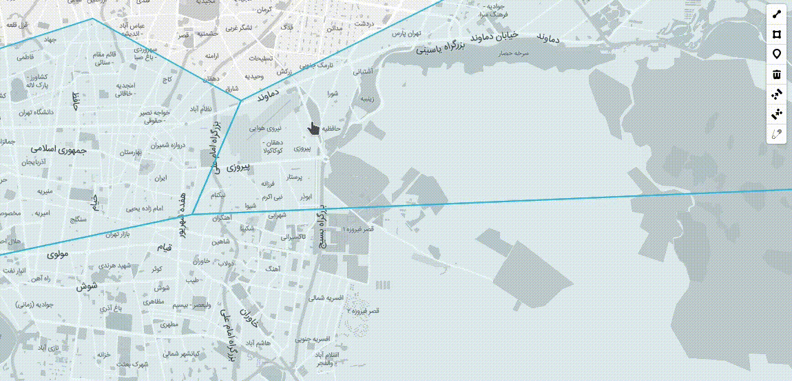

# Mapbox-GL Draw Pinning Mode


Custom mode for [Mapbox GL Draw](https://github.com/mapbox/mapbox-gl-draw) for pinning shared coordinates together during edit.

## Demo

See a full example in the docs folder, or check at the [**Demo**](https://mhsattarian.github.io/mapbox-gl-draw-pinning-mode).



## Install

```shell
npm i mapbox-gl-draw-pinning-mode
```

or use CDN:

```html
<script src="https://unpkg.com/mapbox-gl-draw-pinning-mode"></script>
```

## Usage

```js
import mapboxGlDrawPinningMode from "mapbox-gl-draw-pinning-mode.js";
// or global variable `mapboxGlDrawPinningMode` when using script tag

const draw = new MapboxDraw({
  modes: {
    ...MapboxDraw.modes,
    pinning_mode: mapboxGlDrawPinningMode,
  },
});

// inherited from, and acting similar to simple_select
draw.changeMode("pinning_mode");
```

This mode inherits `simple_select` mode from the `mapbox-gl-draw`, so the Behavior is quite the same.

## Acknowledgement

this project is inspired from `Pinning` feature of [leaflet-geoman (Pro)](https://geoman.io/blog/pinning-now-in-leaflet-geoman-pro) project.
